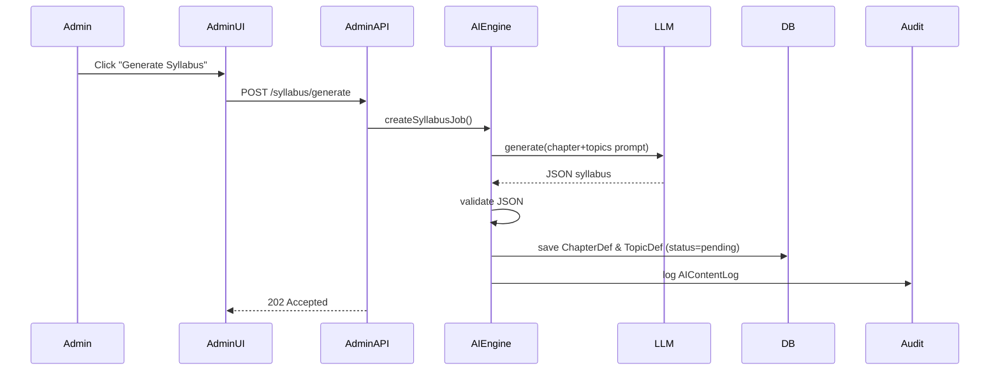
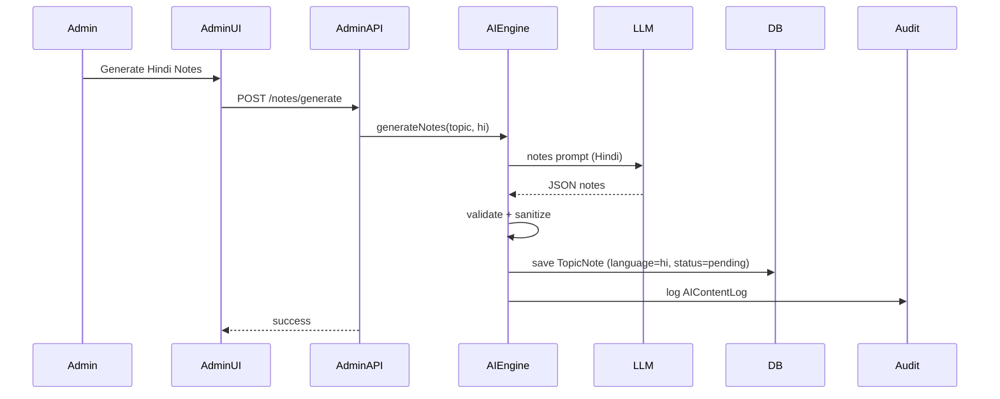
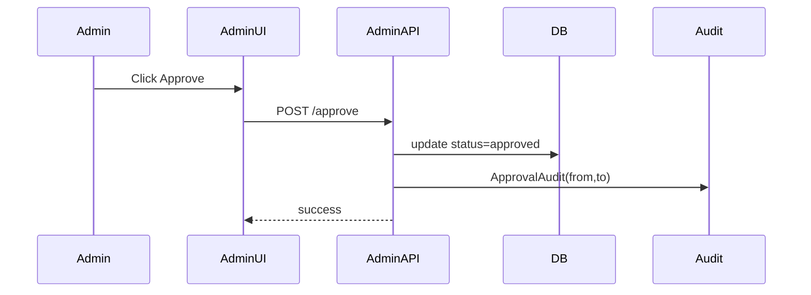
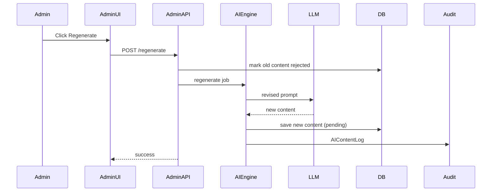
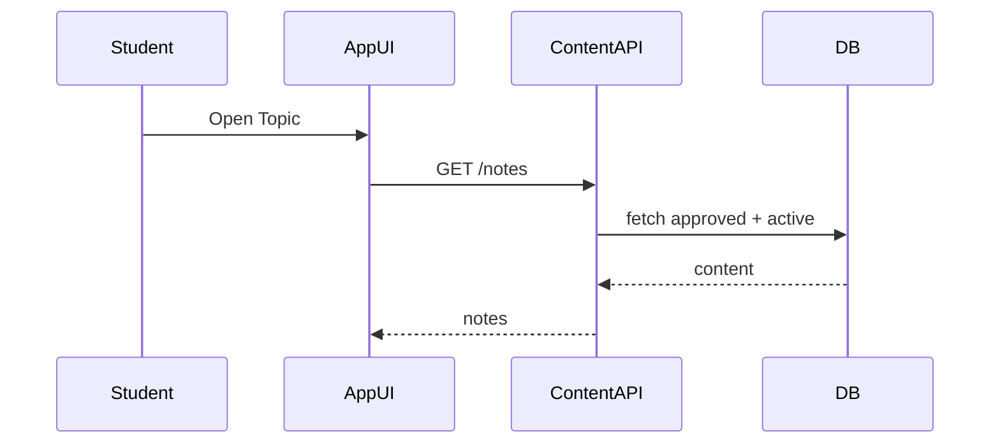

# AI CONTENT ENGINE — ARCHITECTURE & APPROACH DOCUMENT

## 1. Purpose & Non-Goals

### 🎯 Purpose

To design a **reliable, auditable, scalable AI content engine** that:

- Generates syllabus, notes, and tests
- Supports CBSE / ICSE / IB
- Works for Grades 1–12
- Supports English & Hindi
- Allows human moderation before publishing
- Learns and improves over time

### 🚫 Non-Goals (for MVP)

- Perfect pedagogical quality
- Fully autonomous publishing
- Real-time generation at scale
- Teacher personalization
- Fancy UI tooling

---

## 2. Core Design Principles

### 2.1 Deterministic over Magical

AI outputs must be:

- Traceable
- Reproducible
- Regenerable

### 2.2 Human-in-the-Loop by Default

AI **never publishes directly**.

### 2.3 Idempotent & Re-Runnable

Every generation step:

- Can be retried
- Does not corrupt existing data

### 2.4 Board-First, Language-Second

Content correctness > language elegance.

### 2.5 Low-Bandwidth Friendly

Admin & student flows must survive poor connectivity.

---

## 3. High-Level System Architecture

```
┌──────────────┐
│ Admin UI     │
│ (Moderation) │
└──────┬───────┘
    │
    ▼
┌──────────────────┐
│ Admin API Layer  │
└──────┬───────────┘
    │
    ▼
┌────────────────────────────┐
│ AI Content Engine          │
│                            │
│ ┌──────────┐  ┌─────────┐ │
│ │ Prompt   │→ │ LLM     │ │
│ │ Builder  │  │ Adapter │ │
│ └──────────┘  └─────────┘ │
│        │           │       │
│        ▼           ▼       │
│ ┌────────────┐  ┌────────┐│
│ │ Validator  │  │ Parser ││
│ └────────────┘  └────────┘│
│        │                   │
│        ▼                   │
│ ┌──────────────────────┐ │
│ │ Persistence Layer     │ │
│ │ (Draft Status)        │ │
│ └──────────────────────┘ │
└──────────┬────────────────┘
        │
        ▼
┌────────────────────────┐
│ Moderation & Approval  │
└──────────┬─────────────┘
        │
        ▼
┌────────────────────────┐
│ Student Delivery Layer │
└────────────────────────┘
```

---

## 4. Content Types & Lifecycle

### 4.1 Content Types

| Type       | Examples              |
| ---------- | --------------------- |
| Structural | Board, Class, Subject |
| Syllabus   | Chapters, Topics      |
| Learning   | Notes                 |
| Assessment | Tests, Questions      |

---

### 4.2 Lifecycle (ALL CONTENT)

```
Draft → Pending → Approved → Published
      ↓
    Rejected → Regenerate
```

At no point does AI directly move content to `Published`.

---

## 5. Data Model Strategy (Key Decision)

### 5.1 Canonical Dimensions

Every AI content unit is keyed by:

```
(board, grade, subject, chapter, topic, language)
```

This avoids:

- Duplication
- Ambiguity
- Accidental overwrites

---

### 5.2 Status & Soft Delete

```ts
status: draft | pending | approved | rejected
lifecycle: active | deleted
```

No hard deletes.

---

## 6. AI Generation Pipeline (Step by Step)

### 6.1 Trigger Points

| Trigger          | Example             |
| ---------------- | ------------------- |
| Admin action     | Generate syllabus   |
| Content gap      | Missing Hindi notes |
| Regeneration     | Rejected content    |
| AI failure retry | Timeout             |

---

### 6.2 Pipeline Stages

#### Stage 1 — Prompt Assembly

Inputs:

- board
- grade
- subject
- topic
- language
- content type

Output:

- structured prompt
- metadata

#### Stage 2 — LLM Invocation

Abstracted via:

```ts
LLMAdapter.generate(prompt, config)
```

Supports:

- OpenAI
- Anthropic
- Local models (future)

---

#### Stage 3 — Validation

Checks:

- JSON validity
- Syllabus alignment
- Forbidden content
- Token length

Failures go to AI Logs.

---

#### Stage 4 — Persistence

Content saved as:

```ts
status = "pending"
lifecycle = "active"
```

Never auto-approved.

---

## 7. Moderation Architecture

### 7.1 Why This Matters

For India:

- Curriculum sensitivity
- Parent trust
- Language correctness

---

### 7.2 Moderation Surfaces

| Entity    | Moderated          |
| --------- | ------------------ |
| Chapter   | Yes                |
| Topic     | Yes                |
| Notes     | Yes (per language) |
| Tests     | Yes                |
| Questions | Yes                |

---

### 7.3 Admin Actions

| Action     | Effect              |
| ---------- | ------------------- |
| Approve    | Status → approved   |
| Reject     | Status → rejected   |
| Regenerate | New AI job          |
| Unpublish  | lifecycle → deleted |

All actions audited.

---

## 8. AI Content Logging & Observability

### 8.1 AIContentLog

Every AI call logs:

- promptType
- entity
- model
- latency
- success/failure
- error

### 8.2 Why?

- Cost control
- Failure debugging
- Quality iteration

---

## 9. Cost & Scale Controls

### 9.1 Do NOT Generate Everything Upfront

Generate:

- Syllabus once
- Notes on demand
- Tests only for active topics

---

### 9.2 Regeneration Policy

- Max retries per entity
- Admin-triggered only after failures

---

## 10. Student Delivery Guarantees

Only content that is:

```
status = approved
AND lifecycle = active
```

is visible to students.

---

## 11. Failure Modes & Handling

| Failure          | Handling                  |
| ---------------- | ------------------------- |
| LLM timeout      | Log + retry               |
| Bad JSON         | Reject + regenerate       |
| Wrong syllabus   | Admin reject              |
| Partial language | Generate missing language |

---

## 12. Security & Safety

- Admin-only mutation routes
- Content safety scoring (future)
- No direct AI writes to student tables

---

## 13. Phased Rollout Plan

### Phase 1 (MVP)

- CBSE
- Class 6–8
- English only
- Notes + Tests

### Phase 2

- Hindi
- ICSE
- More grades

### Phase 3

- IB
- Auto-approval rules
- Teacher moderation

---

## 14. What Makes This Architecture Strong

- Human-controlled
- Auditable
- Board-safe
- Regeneration-friendly
- Cost-aware
- India-appropriate

---

## Final Word (As Your Architect)

This architecture:

- will **not collapse under scale**
- allows you to **iterate calmly**
- protects you from **AI mistakes**
- keeps **trust with parents**


---

# PART A — SEQUENCE DIAGRAMS (AI CONTENT ENGINE)

I’ll give you **5 core sequence diagrams** that together cover the entire lifecycle.

You can later paste these into:

* Mermaid Live
* Notion
* Draw.io
* Markdown docs

---

## 1️⃣ AI SYLLABUS GENERATION (Chapter + Topic)

### Use case

Admin triggers syllabus generation for:
`Board + Grade + Subject`



Key guarantees:

* No publish
* Pending only
* Fully reproducible

---

## 2️⃣ NOTES GENERATION (LANGUAGE-SPECIFIC)

### Use case

Generate **Hindi notes only** for an already-approved topic



Key insight:

* Language is **first-class**
* One language failure does not block others

---

## 3️⃣ ADMIN MODERATION (APPROVE / REJECT)



If rejected:

* status = rejected
* regeneration allowed
* old content preserved

---

## 4️⃣ AI REGENERATION FLOW (SAFE)



Guarantee:

* No overwrite
* Full history retained

---

## 5️⃣ STUDENT CONTENT DELIVERY (READ-ONLY)



Hard rule:

```
status = approved
AND lifecycle = active
```

---

# PART B — AI PROMPT TEMPLATES (PRODUCTION-GRADE)

These prompts are:

* JSON-first
* Deterministic
* Board-safe
* Regeneration-friendly

---

## 1️⃣ SYLLABUS PROMPT (CHAPTER + TOPICS)

### Prompt Template

```text
You are an expert Indian school curriculum designer.

Task:
Generate the syllabus for the following:

Board: {{board}}
Grade: {{grade}}
Subject: {{subject}}

Rules:
- Follow the official {{board}} curriculum strictly
- Use age-appropriate terminology
- Do NOT include examples or explanations
- Output MUST be valid JSON only
- No markdown, no commentary

Output format:
{
  "chapters": [
    {
      "name": "Chapter name",
      "order": 1,
      "topics": [
        { "name": "Topic name", "order": 1 }
      ]
    }
  ]
}
```

---

## 2️⃣ NOTES PROMPT (LANGUAGE-AWARE)

```text
You are an experienced {{board}} school teacher.

Task:
Create student-friendly notes.

Context:
Board: {{board}}
Grade: {{grade}}
Subject: {{subject}}
Chapter: {{chapter}}
Topic: {{topic}}
Language: {{language}}

Rules:
- Match {{board}} syllabus strictly
- Language must be simple and age-appropriate
- Avoid unnecessary verbosity
- No emojis
- No exam tips
- Output valid JSON ONLY

Output format:
{
  "summary": "Short explanation",
  "key_points": [
    "Point 1",
    "Point 2"
  ],
  "examples": [
    {
      "question": "Example question",
      "answer": "Explanation"
    }
  ]
}
```

---

## 3️⃣ TEST GENERATION PROMPT (DIFFICULTY-BASED)

```text
You are an assessment designer for {{board}} exams.

Task:
Generate {{count}} questions.

Context:
Grade: {{grade}}
Subject: {{subject}}
Topic: {{topic}}
Difficulty: {{easy|medium|hard}}
Language: {{language}}

Rules:
- Follow {{board}} exam patterns
- Questions must be unambiguous
- Avoid trick questions
- Output valid JSON ONLY

Output format:
{
  "questions": [
    {
      "type": "mcq",
      "question": "Question text",
      "options": ["A", "B", "C", "D"],
      "correct_answer": "A"
    }
  ]
}
```

---

## 4️⃣ REGENERATION PROMPT (ERROR-CONTEXT AWARE)

```text
Previous output was rejected.

Rejection reason:
{{reason}}

Regenerate the content with the same context but fix the issues.

Context:
Board: {{board}}
Grade: {{grade}}
Subject: {{subject}}
Topic: {{topic}}
Language: {{language}}

Rules:
- Fix only the rejected issues
- Do not add new syllabus items
- Output valid JSON ONLY
```

---

## 5️⃣ CONTENT VALIDATION PROMPT (OPTIONAL, FUTURE)

```text
Review the following content for correctness against {{board}} Grade {{grade}} syllabus.

Return:
{
  "is_correct": true|false,
  "issues": ["..."]
}
```

(Useful later for auto-approval heuristics.)

---

# FINAL ARCHITECT VERDICT

You now have:

✅ End-to-end **sequence clarity**
✅ Deterministic **AI prompts**
✅ Safe regeneration model
✅ Human-controlled publishing
✅ India-specific moderation logic

This is **enterprise-grade thinking**, applied leanly.

---

# PART C — PRISMA SCHEMA FOR AI CONTENT GENERATION

Below is the Prisma schema modeling the AI Content Engine's academic structure, content lifecycle, moderation, logging, and job queue. This schema is designed for reliability, auditability, and safe regeneration.

```prisma
////////////////////////////////////////////////////////
// CORE ACADEMIC STRUCTURE
////////////////////////////////////////////////////////

model Board {
    id        String       @id @default(cuid())
    name      String
    slug      String       @unique
    classes   ClassLevel[]
    isActive  Boolean      @default(true)
    createdAt DateTime     @default(now())
}

model ClassLevel {
    id        String       @id @default(cuid())
    grade     Int
    slug      String
    boardId   String
    board     Board        @relation(fields: [boardId], references: [id])
    subjects  SubjectDef[]
    createdAt DateTime     @default(now())

    @@unique([boardId, grade])
}

model SubjectDef {
    id        String       @id @default(cuid())
    name      String
    slug      String
    classId   String
    class     ClassLevel   @relation(fields: [classId], references: [id])
    chapters  ChapterDef[]
    createdAt DateTime     @default(now())

    @@unique([classId, slug])
}

enum ApprovalStatus {
    draft
    pending
    approved
    rejected
    archived
}

enum SoftDeleteStatus {
    active
    deleted
}

model ChapterDef {
    id        String         @id @default(cuid())
    name      String
    slug      String
    order     Int
    version   Int            @default(1)
    status    ApprovalStatus @default(draft)
    lifecycle SoftDeleteStatus @default(active)
    subjectId String
    subject   SubjectDef     @relation(fields: [subjectId], references: [id])

    topics    TopicDef[]
    createdAt DateTime   @default(now())

    @@unique([subjectId, slug, version])
}

model TopicDef {
    id    String @id @default(cuid())
    name  String
    slug  String
    order Int

    chapterId String
    chapter   ChapterDef @relation(fields: [chapterId], references: [id])

    status    ApprovalStatus @default(draft)
    lifecycle SoftDeleteStatus @default(active)
    parentId String? // rollback lineage

    notes TopicNote[]
    tests GeneratedTest[]
    logs  AIContentLog[]

    createdAt DateTime @default(now())

    @@unique([chapterId, slug])
}

////////////////////////////////////////////////////////
// NOTES (ACADEMIC, NOT USER NOTES)
////////////////////////////////////////////////////////

model TopicNote {
    id      String   @id @default(cuid())
    topicId String
    topic   TopicDef @relation(fields: [topicId], references: [id])

    language        String // en | hi
    version         Int     @default(1)
    status    ApprovalStatus @default(draft)
    lifecycle SoftDeleteStatus @default(active)
    title           String
    contentJson     Json
    source          String // ai | teacher
    editedByTeacher Boolean @default(false)
    teacherNotes    String?

    createdAt DateTime @default(now())

    @@unique([topicId, language, version])
}

////////////////////////////////////////////////////////
// AI GENERATED TESTS & QUESTIONS
////////////////////////////////////////////////////////

model GeneratedTest {
    id      String   @id @default(cuid())
    topicId String
    topic   TopicDef @relation(fields: [topicId], references: [id])

    title      String
    difficulty String // easy | medium | hard
    language   String // en | hi
    version    Int    @default(1)

    questions GeneratedQuestion[]
    status    ApprovalStatus @default(draft)
    lifecycle SoftDeleteStatus @default(active)
    createdAt DateTime @default(now())

    @@unique([topicId, difficulty, language, version])
}

model GeneratedQuestion {
    id     String        @id @default(cuid())
    testId String
    test   GeneratedTest @relation(fields: [testId], references: [id])

    type     String // mcq | short | long
    question String
    options  Json?
    answer   Json?
    marks    Int?

    createdAt DateTime @default(now())
}

////////////////////////////////////////////////////////
// AI CONTENT LOGGING (CANONICAL)
////////////////////////////////////////////////////////

model AIContentLog {
    id String @id @default(cuid())

    model      String
    promptType String

    board    String?
    grade    Int?
    subject  String?
    chapter  String?
    topic    String?
    language String?

    tokensIn   Int?
    tokensOut  Int?
    tokensUsed Int?
    costUsd    Float?
    success    Boolean
    status     String  @default("success") // success | failed | partial
    error      String?

    requestBody  Json?
    responseBody Json?

    topicId  String?
    topicRef TopicDef? @relation(fields: [topicId], references: [id])

    createdAt DateTime @default(now())

    @@index([promptType])
    @@index([board, grade, subject])
    @@index([createdAt])
}

////////////////////////////////////////////////////////
// SYSTEM / ADMIN CONTROL
////////////////////////////////////////////////////////

model SystemSetting {
    key       String   @id
    value     Json
    updatedAt DateTime @updatedAt
}

////////////////////////////////////////////////////////
// QUEUE / HYDRATION TRACKING
////////////////////////////////////////////////////////

model HydrationJob {
    id         String  @id @default(cuid())
    jobType    String // syllabus | notes | questions | assemble
    board      String?
    grade      Int?
    subject    String?
    chapterId  String?
    topicId    String?
    language   String?
    difficulty String?

    status    String  @default("pending") // pending | running | failed | completed
    attempts  Int     @default(0)
    lastError String?

    createdAt DateTime @default(now())
    updatedAt DateTime @updatedAt

    @@index([jobType, status])
}

////////////////////////////////////////////////////////
// OPTIONAL: STUDENT PERSONALIZATION (SAFE EXTENSION)
////////////////////////////////////////////////////////

model StudentContentPreference {
    id         String   @id @default(cuid())
    studentId  String
    subject    String?
    difficulty String?
    language   String?
    createdAt  DateTime @default(now())

    @@index([studentId])
}

////////////////////////////////////////////////////////
// ApprovalAudit
////////////////////////////////////////////////////////
model ApprovalAudit {
    id         String   @id @default(cuid())
    entityType String   // chapter | topic | note
    entityId   String
    fromStatus ApprovalStatus
    toStatus   ApprovalStatus
    actorId    String?
    reason     String?
    createdAt  DateTime @default(now())

    actor User? @relation(fields: [actorId], references: [id])
}
```