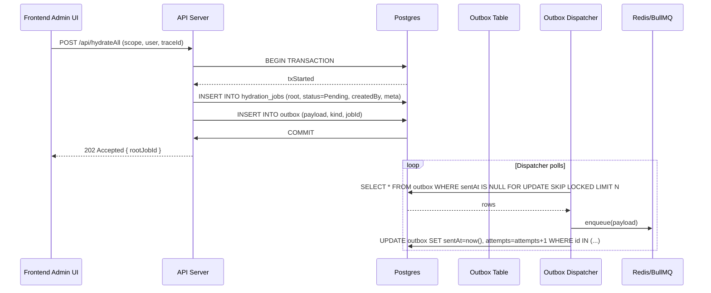
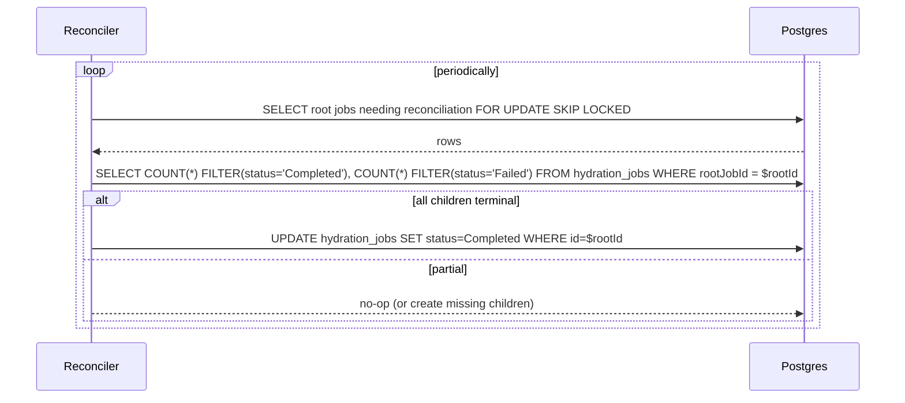
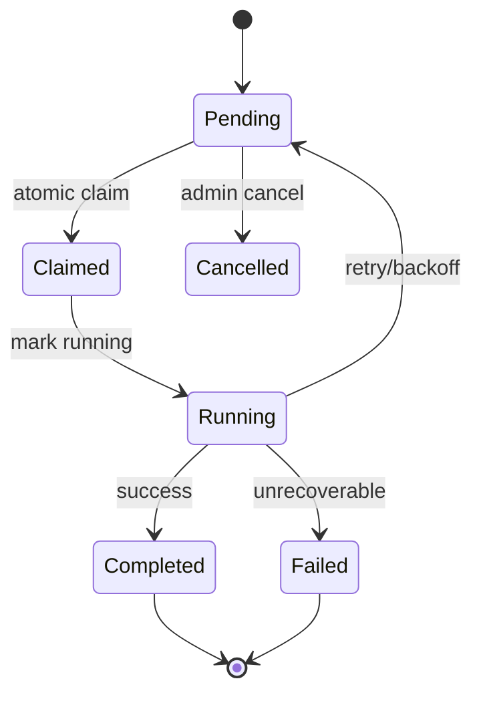

<!--
FILE: hydrateAll architecture one-pager
OBJECTIVE:
- One-page printable architecture and sequence diagrams for the `hydrateAll` pipeline.
-->

# hydrateAll — Architecture One-Pager

## Executive Summary
- Purpose: Controlled, auditable pipeline to (re)generate derived AI content across many entities (subjects, courses).
- Goals: Idempotent execution, short DB transactions, outbox-backed queueing, clear parent/child invariants, strong observability.

---

## High-level Flow

```mermaid
flowchart LR
  A[Frontend Admin UI]
  B[API Server]
  C[(Postgres DB)]
  C1[Outbox Table]
  D[Outbox Dispatcher]
  E[Queue (Redis/BullMQ)]
  F[Worker Pool]
  G[AI/API Services]
  H[Reconciler / Orchestrator]
  I[Monitoring / Logs / Traces]

  A -->|POST /api/hydrateAll| B
  B -->|Create root HydrationJob + Outbox row (tx)| C
  C --> C1
  C1 -->|Polled| D
  D -->|enqueue| E
  E -->|job payload| F
  F -->|claim & run| C
  F -->|AI calls| G
  F -->|persist child content (short txs)| C
  H -->|aggregate child status| C
  F --> I
  H --> I
```

---

## Sequence Diagrams (detailed)

The following sequence diagrams show the exact message flow, DB interactions, and locks used during a typical `hydrateAll` run. They are suitable for inclusion in an enterprise architecture review.

### 1) Submit & Enqueue


Mermaid source (below) is included so reviewers can render or edit the diagram locally. To render PNGs, see `docs/diagrams/README.md`.



### 2) Worker Claim, Execute, Persist


```mermaid
sequenceDiagram
    participant Queue as Redis/BullMQ
    participant Worker as Worker
    participant DB as Postgres
    participant AI as AI/API
    participant Reconciler as Reconciler

    Queue->>Worker: jobPayload (hydrationJobId, scope, traceId)
    Worker->>DB: UPDATE hydration_jobs SET status='Claimed', lockedAt=now(), attempts=attempts+1 WHERE id=$id AND status IN ('Pending')
    alt claim success
      DB-->>Worker: rows=1
      Worker->>DB: BEGIN; INSERT jobExecutionLog (start); UPDATE hydration_jobs SET status='Running'; COMMIT
      Worker->>AI: request generation (async)
      AI-->>Worker: generated content
      loop per-child
        Worker->>DB: BEGIN; INSERT chapter/topic row; COMMIT
      end
      Worker->>DB: BEGIN; INSERT aIContentLog; UPDATE hydration_jobs SET status='Completed', finishedAt=now(); INSERT jobExecutionLog (summary); COMMIT
    else claim failed
      DB-->>Worker: rows=0
      Worker-->>Queue: ack (skip)
    end
```

### 3) Reconciler Aggregation




---

## Data Model (fields & intent)

---

## Data Model (fields & intent)

- `hydration_jobs` (primary job table)
  - `id`, `rootJobId`, `parentJobId` — job lineage
  - `targetType`, `targetId` — what to hydrate (subject, course, etc.)
  - `status` — enum: `Pending`, `Claimed`, `Running`, `Completed`, `Failed`, `Cancelled`
  - `attempts`, `lockedAt`, `startedAt`, `finishedAt`
  - `resultMetadata` (JSONB) — short summary / links

- `outbox`
  - `id`, `payload` (JSONB), `kind`, `jobId`, `sentAt`, `attempts`

- `jobExecutionLog`
  - `id`, `jobId`, `phase` (`start`|`step`|`summary`|`error`), `payload` (JSONB), `createdAt`

- `aIContentLog`
  - `id`, `jobId`, `contentRef`, `status`, `size`, `createdAt`

Design notes:
- Keep `resultMetadata` small and denormalized for fast reads; store full content in dedicated content tables referenced by ids.
- Use JSONB indexes for common queries (e.g., meta->>'language').

---

## SQL Patterns & Examples

- Atomic claim (worker):

```sql
UPDATE hydration_jobs
SET status='Claimed', lockedAt=now(), attempts = attempts + 1
WHERE id = $1 AND status = 'Pending'
```

- Finalize (short tx):

```sql
BEGIN;
INSERT INTO aIContentLog (jobId, contentRef, status) VALUES ($id, $ref, 'ready');
UPDATE hydration_jobs SET status='Completed', finishedAt = now(), resultMetadata = $meta WHERE id = $id;
INSERT INTO jobExecutionLog (jobId, phase, payload) VALUES ($id, 'summary', $summary);
COMMIT;
```

Notes:
- Prefer `FOR UPDATE SKIP LOCKED` when scanning for work to avoid contention.
- Avoid long-lived transactions around AI calls; perform those calls off-tx.

---

## Reconciler Implementation Notes

- Use a distributed locking strategy (DB row lock or Redis lock) to ensure single reconciler per root job.
- TTL on locks (e.g., `lockedAt`) to allow recovery if reconciler crashes.
- Reconciler responsibilities:
  - Aggregate child job statuses and compute root status.
  - Create missing child jobs if orchestration requires multi-stage work.
  - Emit reconciliation metrics and record reconciliation runs in `jobExecutionLog`.

Pseudocode:

```ts
for rootJob in selectRootJobsForReconciliation() {
  lock(rootJob)
  counts = selectChildCounts(rootJob.id)
  if counts.pending === 0 and counts.running === 0 {
    updateRootStatus(rootJob.id, counts.failed > 0 ? 'Failed' : 'Completed')
  }
  unlock(rootJob)
}
```

---

## Enterprise-runbook (expanded)

1) Quick triage — stuck or slow job:

```ps
psql $DATABASE_URL -c "SELECT id, status, attempts, lockedAt, updated_at FROM hydration_jobs WHERE status IN ('Pending','Claimed','Running') ORDER BY updated_at DESC LIMIT 50;"
```

2) Requeue or re-run reconciler (dry-run first):

```bash
npx tsx scripts/hydration-reconciler.ts --rootJobId=<id> --dryRun=false
```

3) Cancel a runaway root job:

```sql
UPDATE hydration_jobs SET status='Cancelled' WHERE id = '<rootJobId>' AND status NOT IN ('Completed','Failed');
```

4) Postmortem collection:
- `jobExecutionLog` for the job
- `aIContentLog` content refs
- Worker logs correlated by `traceId`

---

## Monitoring & Alerts (detailed)

- Prometheus metrics to expose:
  - `hydrate_jobs_created_total{target}`
  - `hydrate_jobs_completed_total{target}`
  - `hydrate_jobs_failed_total{target}`
  - `hydrate_job_duration_seconds` (histogram)
  - `outbox_send_latency_seconds`

- Alert rules (examples):
  - `alert:HydrateJobsBacklogHigh` when `hydrate_jobs_created_total - hydrate_jobs_completed_total > 1000` for 10m
  - `alert:HydrateJobFailures` when `rate(hydrate_jobs_failed_total[5m]) > 0.05` of created

---

## Security & Compliance (expanded)

- Only admin principals may call `POST /api/hydrateAll`. All calls must be audited with `traceId` and user id.
- Redact or avoid storing PII in `jobExecutionLog` and `aIContentLog`.
- Encryption in transit (TLS) and at rest for DB.

---

If you'd like, I can render these Mermaid diagrams to PNG/SVG and include them inline for the meeting slide deck or produce a PDF printable one-pager.

## HydrationJob State Machine



Key invariants:
- Only one worker may claim a job (atomic UPDATE where status=Pending).
- Workers do not create child HydrationJobs; orchestrator/reconciler manages children.
- All DB state transitions occur in short transactions; long-running AI calls happen outside tx.

---

## Worker Execution Pattern (recommended)
1. Short tx: claim job (status -> Claimed) and create `jobExecutionLog` start row.
2. Short tx: mark status -> Running.
3. Off-tx: perform AI calls / content generation.
4. For each child/content row: persist in its own short tx (avoid long transactions).
5. Final short tx: write `AIContentLog`, `jobExecutionLog` summary, set status -> Completed/Failed and set `finishedAt`.

---

## Error Handling & Retries
- Retry transient errors with exponential backoff; use `attempts` and queue-delayed retries.
- On permanent validation errors, mark job Failed with structured reason in `jobExecutionLog`.
- Use `lockedAt` TTL and reconciler to detect and recover stuck/claimed jobs.

---

## Observability & Runbook
- Emit metrics: jobs created/claimed/completed/failed, avg durations, outbox latency.
- Structured logs linking `rootJobId` and `traceId` across components.
- Runbook highlights: query stuck jobs, requeue via debug scripts, cancel root jobs, run `hydration-reconciler` manually.

---

## Key Files (reference)
- `lib/execution-pipeline/submitJob.ts` — job submission & outbox creation
- `scripts/hydration-reconciler.ts` — reconciler/orchestrator
- `scripts/hydrateAll.ts` — admin trigger helper
- `worker/services/*` — worker implementations (e.g., `syllabusWorker.ts`)
- `Docs/Hydration_Rules.md` — operational guardrails

---

For a slide-friendly version with talking points and diagrams, see `docs/hydrateAll-slides.md`.
