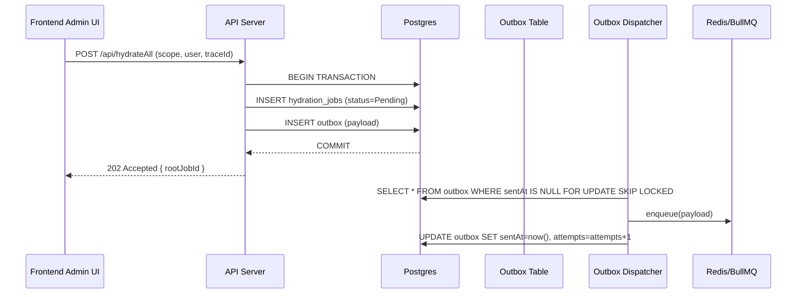
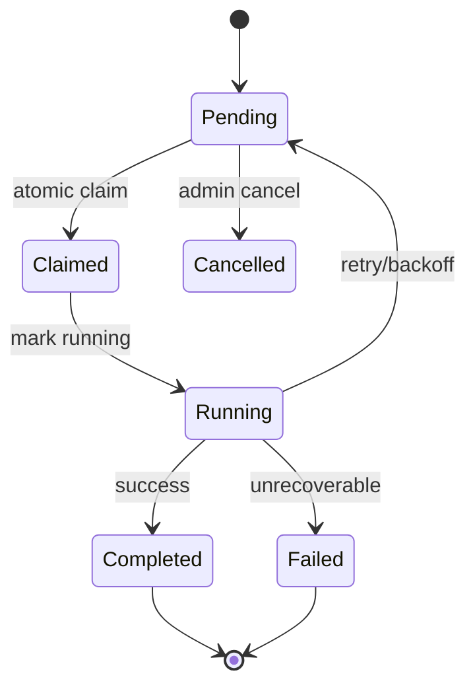

<!--
FILE: hydrateAll slide deck (markdown)
OBJECTIVE:
- Slide deck text in markdown with embedded diagrams for enterprise architecture review.
-->

# Slide 1 — Title

hydrateAll Pipeline: Architecture, Invariants, and Runbook

- Presenter: Engineering
- Date: 2026-01-31

---

# Slide 2 — Executive Summary

- Purpose: Generate/refresh AI-derived content at scale (subjects, courses).
- Goals: predictable execution, idempotency, short DB txs, reliable queueing, operator visibility.

---

# Slide 3 — High-level Flow

```mermaid
flowchart LR
  A[Frontend Admin UI]
  B[API Server]
  C[(Postgres DB)]
  C1[Outbox Table]
  D[Outbox Dispatcher]
  E[Queue (Redis/BullMQ)]
  F[Worker Pool]
  G[AI/API Services]
  H[Reconciler / Orchestrator]
  I[Monitoring / Logs / Traces]

  A -->|POST /api/hydrateAll| B
  B -->|Create root HydrationJob + Outbox row (tx)| C
  C --> C1
  C1 -->|Polled| D
  D -->|enqueue| E
  E -->|job payload| F
  F -->|claim & run| C
  F -->|AI calls| G
  F -->|persist child content (short txs)| C
  H -->|aggregate child status| C
  F --> I
  H --> I
```

Talking points:
- Outbox guarantees DB-backed enqueue semantics.
- Workers must perform short DB txs to avoid pooled DB transaction errors.

---

# Slide 4a — Sequence Diagram (Submit & Enqueue)



---

# Slide 4b — Sequence Diagram (Worker Claim & Execute)

```mermaid
sequenceDiagram
  participant Queue as Redis/BullMQ
  participant Worker as Worker
  participant DB as Postgres
  participant AI as AI/API

  Queue->>Worker: jobPayload (hydrationJobId)
  Worker->>DB: UPDATE hydration_jobs SET status='Claimed', lockedAt=now() WHERE id=$id AND status='Pending'
  Worker->>DB: BEGIN; INSERT jobExecutionLog (start); UPDATE hydration_jobs SET status='Running'; COMMIT
  Worker->>AI: generate content
  AI-->>Worker: content
  loop per-child
    Worker->>DB: BEGIN; INSERT chapter/topic row; COMMIT
  end
  Worker->>DB: BEGIN; INSERT aIContentLog; UPDATE hydration_jobs SET status='Completed', finishedAt=now(); COMMIT
```

---

# Slide 5 — Worker Execution Pattern (detailed)

---

# Slide 4 — HydrationJob State Machine



Talking points:
- Claims are atomic updates; if update affects 0 rows, another worker claimed it.
- Workers should not spawn child HydrationJobs—reconciler/orchestrator does.

---

# Slide 5 — Worker Execution Pattern (detailed)

1. Short tx: claim job + write execution-start log.
2. Short tx: mark Running.
3. Off-tx: call AI, generate content.
4. Persist each child/content row in its own short tx.
5. Final short tx: write AIContentLog + execution summary and mark Completed/Failed.

Note: Use `runTxWithRetry()` and idempotency keys for safe retries.

---

# Slide 6 — Failure Modes & Mitigations

- Transient API errors: retry with exponential backoff; log attempts.
- Worker crash: use `lockedAt` TTL; reconciler reclaims or requeues.
- Partial writes: reconciler detects partial children; requeue missing work.
- DB transaction loss: adopt short per-item txs; avoid long-held txs.

---

# Slide 7 — Observability & Alerts

- Metrics: job rates, latencies, outbox enqueue latency, worker claim failures.
- Logs: structured, include `rootJobId`, `jobId`, `traceId`.
- Alerts: high failure rate, backlog threshold, repeated tx errors.

---

# Slide 8 — Operational Runbook (quick)

1. Check reconciler last-run and queue depth.
2. Query stuck jobs: `SELECT * FROM hydration_jobs WHERE status IN ('Pending','Claimed') AND updated_at < now() - interval '10 minutes'`
3. Requeue via `scripts/requeue-pending.js` or run `npx tsx scripts/hydration-reconciler.ts --rootJobId=<id> --dryRun=false`.
4. Cancel abusive root jobs: PATCH job status -> Cancelled.

---

# Slide 9 — Testing & Deployment

- Unit: state transitions, outbox creation, reconciler counting.
- Integration: submit -> outbox -> dispatcher -> worker (use local Redis + test DB).
- Chaos: simulate worker restarts, DB connection drops.
- Deploy: prefer `tsx` for ad-hoc admin runs; compile to `.cjs` for PM2 production if needed.

---

# Slide 10 — Appendix & Key Files

- `lib/execution-pipeline/submitJob.ts`
- `scripts/hydration-reconciler.ts`
- `scripts/hydrateAll.ts`
- `worker/services/syllabusWorker.ts` (example short-tx refactor)
- `Docs/Hydration_Rules.md`

End of deck.
